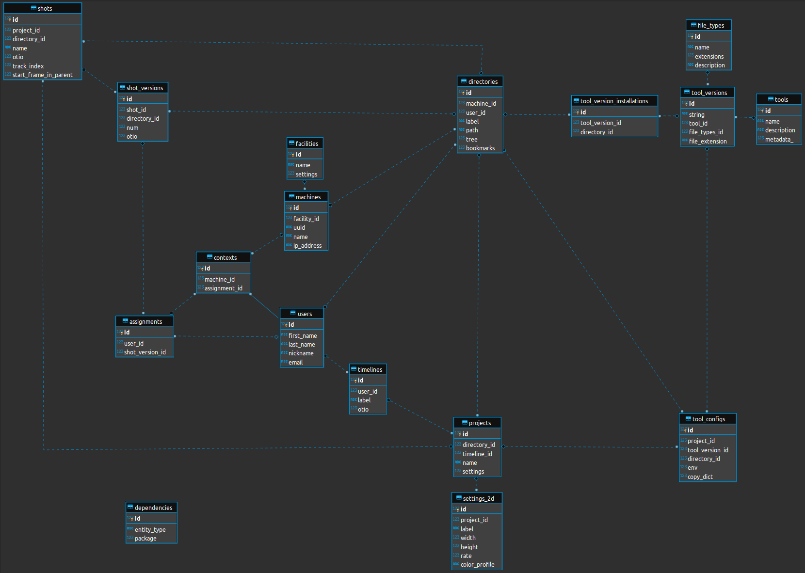

<p align="center">
  
</p>


## Magnetic-Lab Pipeline API for Content Creators
Magla is an effort to bring the magic of large-scale professional visual effects pipelines to small-scale studios and freelancers - for free. Magla features a backend designed to re-enforce the contextual relationships between things in a visual effects pipeline - a philosophy which is at the core of Magla's design. The idea is that with any given `MaglaEntity` one can traverse through all the related `entities` as they exist in the DB. This is achieved with a `Postgres` + `SQLAlchemy` combination allowing for an excellent object-oriented interface with powerful SQL queries and relationships behind it.

## Getting Started
You will need to first set the following environment variables required for `magla` to function:

- `MAGLA_DB_DATA_DIR` <-- this is where your `sqlite` db will be written to
- `MAGLA_DB_NAME` <-- name of your DB
- `MAGLA_MACHINE_CONFIG_DIR` <-- this directory holds information about the current machine needed by `magla`

Linux:
```bash
export MAGLA_DB_DATA_DIR=/path/to/magla_data_dir
export MAGLA_DB_NAME=magla
export MAGLA_MACHINE_CONFIG_DIR=/path/to/magla_machine_dir
```

Windows:
```cmd
SET MAGLA_DB_DATA_DIR="<drive>:\\path\to\magla_data_dir"
SET MAGLA_DB_NAME="magla"
SET MAGLA_MACHINE_CONFIG_DIR="<drive>:\\path\to\magla_machine_dir"
```

### Installing
```bash
git clone https://github.com/magnetic-lab/magla.git
cd magla
pip install .
```

#### Example Usage within Python shell:
```python
import magla

# to instantiate `User` entity for currently logged in user(no argument is needed, user's name is used):
user = magla.User()

# to get the project settings associated to the user via their most recent assignment:
project_settings = user.assignments[-1].shot_version.shot.project.settings

#the above can also be shortened to:
project_settings = user.assignments[-1].project.settings
```
Comparing the above examples to the diagrom below and you can see the connective routes that can be traversed based on Magla's schema relationships:


### [OpenTimelineIO](https://github.com/PixarAnimationStudios/OpenTimelineIO)-centric design
In the heat of production there is always a consistent demand for creating, viewing, and generally altering edits in various ways and in various contexts, for all kinds of reasons. This is the reason for another core philosophy of Magla, which is that timelines and edits should be the driving force of the pipeline.

In Magla, timelines can be requested, and then dynamically generated on the fly using your production data. This will enable superior features development and automation, as well as hopefully break some shackles and give the idea of an edit more of an expressionistic, non-binding and ultimitely, more creative feeling. 

`MaglaProject`, `MaglaShot`, and `MaglaShotVersion` objects all include companion `opentimelineio.schema` objects which are mirror representations of eachother. The `opentimelineio` objects are saved in `JSON` form in the DB.

Breakdown of `MaglaEntity` types and their associated `opentimelineio.schema` types:
- `Project` <--> `opentimelineio.schema.Timeline`
- `Shot` <--> `opentimelineio.schema.Clip`
- `ShotVersion` <--> `opentimelineio.schema.ExternalReference`

in the Magla ecosystem `ShotVersion`'s are considered sacred and only one can be current at any given time, even new assignments result in new versions. For this reson they are used as the actual `ExternalReference` of the shot `Clip` -  so only the latest versions of shots are used as meda references. Each time you instantiate a `MaglaProject` object it builds its otio data off of current production data and thus is always up-to-date and **requires no actual timeline file to  be archived on disk or kept track of**.

### Example Initial Setup
All creation and deletion methods are in `magla.Root`, so this is primarily a demonstration of
using the creation methods in the optimal order.

Each creation method will return the created `MaglaEntity` or in the case that a record already
exists, creation will abort and return the found record instead. To instead throw an
`EntityAlreadyExistsError`, you must call the `magla.Root.create` method directly and pass the
'return_existing=False` entity_test_fixtureeter.
    example:
    ```python
    magla.Root().create(magla.User, {"nickname": "foo"}, return_existing=False)
    ```

This functionality is demonstrated below where the name of the shot being created is set to
increment - meaning that running this script repeatedly will result in new shot and directory
tree structures under the same project.

```python
import magla

# instantiate a MaglaRoot object. Creation and deletion must be done via the MaglaRoot class.
r = magla.Root()

# create a Machine
current_machine = r.create_machine()

# create User
user = r.create_user(getpass.getuser())

# create Facility
facility = r.create_facility("test_facility",
	settings={"tool_install_directory_label": "{tool_version.tool.name}_{tool_version.string}"})
```
The above creates a new `Postgres` column in the 'facilities' table and returns a `MaglaFacility` object pre-populated with data in the '<MaglaEntity>.data' property.

Project settings are sent in as a dictionary which is stored as `JSON` in `Postgres`. At runtime a `MaglaEntity` object gets injected and Python's native string formatting can be used to access the object's relationships and attributes for custom naming.
```python
# Create 2D settings template
# a custom creation method doesn't exist for this entity type so the 'create' method is used directly.
settings_2d = r.create(magla.Settings2D, {
    "label": "Full 4K @30FPS",
    "width": 4096,
    "height": 2048,
    "rate": 30
})

# Create Project
test_project = r.create_project("test", "/mnt/projects/test",
    settings={
        "project_directory": "/mnt/projects/{project.name}",
        "project_directory_tree": [
            {"shots": []},
            {"audio": []},
            {"preproduction": [
                {"mood": []},
                {"reference": []},
                {"edit": []}]
            }],
        "frame_sequence_re": r"(\w+\W)(\#+)(.+)",  # (prefix)(frame-padding)(suffix)
        "shot_directory": "{shot.project.directory.path}/shots/{shot.name}",
        "shot_directory_tree": [
            {"_current": [
                {"h265": []},
                {"png": []},
                {"webm": []}]
            }],
        "shot_version_directory": "{shot_version.shot.directory.path}/{shot_version.num}",
        "shot_version_directory_tree": [
            {"_out": [
                {"exr": []},
                {"png": []}]
            }],
        "shot_version_bookmarks": {
            "representations": {
                "png_sequence": "{shot_version.directory.path}/_out/png/{shot_version.full_name}.####.png"
            }
        }
    },
    settings_2d_id=settings_2d.id
    )

# Create Shot with incrementing name
shot = r.create_shot(project_id=test_project.id, name="shot{:02d}".format(
    len(test_project.shots))
)

# create Assignment
assignment = r.create_assignment(
	shot_id=shot.data.id,
	user_id=user.id)

# start natron
magla.Tool("natron").start()
```

For relational tables the creation method will usually need more than one arg for each child `SQL` table.
The below creates `Tool`, `ToolVersion`, `ToolVersionInstallation`, and `FileType` entities which are related via foreign keys in `Postgres`.
```python
# Create Tool, ToolVersion, ToolVersionInstallation, FileType
natron_2_3_15 = r.create_tool(
    tool_name="natron",
    install_dir="/opt/Natron-2.3.15",
    exe_path="/opt/Natron-2.3.15/bin/natron",
    version_string="2.3.15",
    file_extension=".ntp")

# Create ToolConfig in order to have tool-specific subdirs and launch settings
tool_config = r.create_tool_config(
    tool_version_id=natron_2_3_15.id,
    project_id=test_project.id,
    directory_tree=[
        {"_in": [
            {"plate": []},
            {"subsets": []}
        ]},
        {"_out": [
            {"exr": []},
            {"png": []},
            {"subsets": []}]
         }]
)
```

To query all entities of a type:
```python
# use `all` method to retrieve list of all entity records by entity type.
r.all(magla.User)
r.all(magla.ShotVersion)
r.all(magla.Directory)
```
### Building and exporting timelines
```python
t = test_project.timeline
# current process for generating timelines is sending list of `MaglaShot` objects to `build` method
t.build(test_project.shots)
# `MaglaShot` objects include a 'track_index' and 'start_frame_in_parent' property which are
#  external to `opentimlineio` but used by `magla` for automatic building. This implementation
#  may change.
t.otio.to_json_file("test_project.json")
```

### Development Setup:
Running tests require a `MAGLA_TEST_DIR` environment varable pointing to a directory containing `seed_data.yaml` and `test_project.otio` files. Initially you can set this to the included `magla/tests` directory.
```bash
export MAGLA_TEST_DIR=/path/to/magla/tests
```

#### Installing in dev mode:
```bash
git clone https://github.com/magnetic-lab/magla.git
cd magla
pip install .[dev]
```

#### Running coverage report and tests:
```bash
coverage run --source magla -m pytest -v
coverage report
```

## Magla Roadmap
<p>

</p>

- Asset-tracking and management integration with existing tools and libraries.
- Complete control over code-deployment and version-locking for nearly any entity-type with hierarchical inheritence of `MaglaDependency` objects. 
- Abstract away the movement of individual files as much as possible so users can feel like they are working and building with blocks.
- `Pyside` UI's for Magla core and mainstreamn DCC apps like Nuke and Maya. UI's **must** be timeline-centric in nature, highly visual, utilizing many subtle visual ques to denote underlying data.
- User permissions system to restrict sensitive Magla funcionality.
- Statistical data collection and in the future, analasys tools using 3rd party tools.
- Integration with web API services like google drive and Amazon cloud as an interchangeable alternative file-storage within the Magla ecosystem.
- The `PostgreSQL` backend Magla uses should be easily swapped out with any backend of any kind of your choosing.
